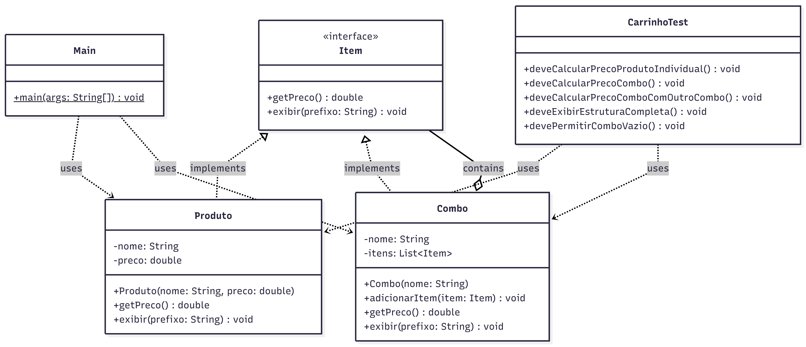

# 🛒 Carrinho de Compras com Composite

Projeto desenvolvido em Java com o objetivo de demonstrar a aplicação do **padrão de projeto Composite** em conjunto com o **princípio da responsabilidade única (SRP)**.

---

## 📌 Sobre o projeto

O sistema simula um carrinho de compras com produtos individuais e combos gamers.

Os combos podem conter tanto produtos quanto outros combos, formando uma estrutura hierárquica flexível. O padrão Composite permite tratar objetos individuais e composições de objetos da mesma maneira.

---

## 🧱 Estrutura do projeto

```id="m80a94"
src/
├── main/
│   └── carrinho/
│       ├── Item.java           // Interface base do composite
│       ├── Produto.java        // Produto individual (Leaf)
│       ├── Combo.java          // Grupo de produtos/combo (Composite)
│       └── Main.java           // Execução do sistema
│
└── test/
    └── carrinho/
        └── CarrinhoTest.java   // Testes unitários
```

---

## 🧠 Padrões e princípios utilizados

### 🔹 Composite

Permite tratar objetos individuais e grupos de objetos de forma uniforme.

No projeto:

* `Produto` representa um item individual
* `Combo` representa agrupamentos de itens
* Um combo pode conter produtos e outros combos

---

### 🔹 SRP (Single Responsibility Principle)

Cada classe possui uma única responsabilidade:

* `Item` → contrato comum
* `Produto` → representação de produto individual
* `Combo` → gerenciamento de grupos/composições
* `Main` → execução

---

## 📊 Diagrama de Classes



---

## ▶️ Como executar o projeto

### 🔹 Executar a aplicação (Main)

1. Abra o projeto no IntelliJ
2. Navegue até:

   ```
   src/main/carrinho/Main.java
   ```
3. Clique com o botão direito → **Run 'Main.main()'**

---

### 🧪 Executar os testes

1. Navegue até:

   ```
   src/test/carrinho/CarrinhoTest.java
   ```
2. Clique com o botão direito → **Run 'Tests'**

> Certifique-se de que o JUnit 5 está configurado no projeto.

---

## ✅ Exemplo de saída

```id="0vzgzj"
Setup Completo - Total: R$1900.0
   Combo Gamer - Total: R$700.0
      Mouse Gamer - R$150.0
      Teclado Mecânico - R$300.0
      Headset RGB - R$250.0
   Monitor 144Hz - R$1200.0

Valor total: R$1900.0
```
